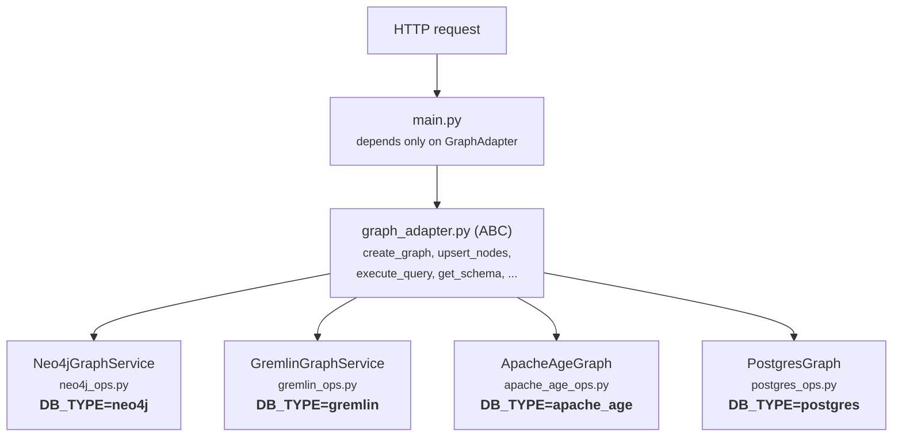

# Graph Database API v2 -- FastAPI + Neo4j / Cosmos DB Gremlin / Apache AGE / PostgreSQL

Implements `graph-api-v2.yaml`: graph lifecycle, schema
(constraints/indexes), node/relationship upserts, read/write queries,
stats, and health -- all under `/api/v2`, protected by a bearer token.
Backed by **Neo4j**, **Azure Cosmos DB's Gremlin API**, **Apache AGE**, or **PostgreSQL**,
switchable via `DB_TYPE` in `.env` without requiring any code changes.

## Files

-   `graph_adapter.py` -- the `GraphAdapter` interface both backends
    implement, plus shared errors/utilities. `main.py` and `llm.py`
    depend only on this file, never on a concrete backend.
-   `neo4j_ops.py` -- Neo4j implementation of `GraphAdapter`
    (`Neo4jGraphService`)
-   `gremlin_ops.py` -- Cosmos DB Gremlin implementation of
    `GraphAdapter` (`GremlinGraphService`)
-   `main.py` -- FastAPI routes + Pydantic request/response models.
    Picks a backend at startup via `DB_TYPE`.
-   `prompts.py` -- system prompt text for natural-language-to-query
    translation and Cypher-to-Gremlin translation (see **Translation
    fidelity** below).
-   `llm.py` -- Azure OpenAI client + query generation/validation,
    including post-translation fidelity checks (see below). Used by
    `/query` and `/write` in two ways: (1) when the caller sends a
    `prompt` (natural language) instead of a query, it's generated
    directly in the active backend's dialect; (2) when the caller sends
    `query` (always Cypher) against a non-Neo4j backend, it's translated
    into that backend's dialect. Neo4j and Apache Age backends skip the LLM entirely
    for `query` bodies.
-   `.env`
-   `cypher_to_gremlin.jsonl` -- a persistent Cypher -\> Gremlin lookup
    cache. Loaded into memory once at process startup (see **Query
    lookup cache** below); it is not read again until the process
    restarts.

## Adapter pattern




`main.py` calls a small factory (`_build_service()`) at startup that
reads `DB_TYPE` and lazily imports + constructs the matching class. Only
the driver package for the backend you're using needs to actually work
at runtime (the other's import is never reached).

### Neo4j design note

Neo4j Community Edition only has one database. Rather than requiring
Enterprise multi-database, each "graph" from the spec is a **logical
namespace** inside your single `NEO4J_DB` database: every node gets an
extra label `Graph_<uuid>` so it can be scoped/queried/counted cheaply.
Constraints and indexes are real Neo4j schema objects (which are
inherently global to a label in Neo4j), tracked per-graph via metadata
nodes so `GET /schema` and `GET /stats` report correctly per graph.

Neo4j properties are schema-free, so there's no equivalent of the
Gremlin reserved-name restriction below -- you can name a property
`type`, `label`, etc. freely on Neo4j. This README still avoids those
names in its own examples (using `policy_type` instead of `type`) so the
same request bodies work unchanged against either backend, which is the
whole point of the adapter pattern.

### Gremlin / Cosmos DB design note

Same idea, different vocabulary: each "graph" is a scoping property on
every vertex inside your single Cosmos Gremlin collection.

**Partition key -- read this first.** Cosmos DB requires every vertex to
carry the container's actual partition key property, or writes fail with
`Cannot add a vertex where the partition key property has value 'null'`.
This adapter reuses its graph-scoping property as the partition key, so
its name has to match your container's real partition key path. Check
yours in the Azure Portal: **Cosmos DB account -\> Data Explorer -\>
your graph -\> Scale & Settings -\> Partition Key** (commonly `/pk`,
sometimes something custom). Set `GREMLIN_PARTITION_KEY` in `.env` to
that path *without* the leading slash. It defaults to `graph_id`, which
only works if your container happens to use that exact path.

**Reserved property names -- read this too.** Cosmos DB stores
vertices/edges as documents with reserved top-level fields `id`,
`label`, and `type` (`"vertex"`/`"edge"`). Setting a regular Gremlin
*property* with one of these names collides with the reserved field and
can silently corrupt the document -- it stops being recognized as a
valid vertex by later `hasLabel()`/`has()` queries. `gremlin_ops.py`'s
`_check_prop_name` rejects `id`, `label`, `type`, and your configured
partition-key name as regular property names on `/nodes` and
`/relationships` payloads, returning a `400` with an explanation rather
than letting the corruption happen silently. **`id` is the one
exception**: it's allowed (and expected) as a relationship endpoint's
match/create key (`{"key": {"id": "..."}}`), just not as a free-standing
property in a `properties` block.

Practical consequence: if your domain model has a natural `type` field
(e.g. `Policy.type = "auto"`), rename it before writing to a
Gremlin-backed graph -- e.g. `policy_type`. This README's examples use
`policy_type` throughout for exactly this reason.

A few other real differences from the Neo4j path, worth knowing before
you rely on them:

-   **Multiple labels**: a node's `labels` array maps to a single
    Gremlin vertex label (`labels[0]`) since Cosmos vertices only have
    one label; any extra labels are stored on an `extra_labels` property
    instead.
-   **Constraints**: Cosmos Gremlin has no native unique-constraint
    feature. `POST /schema/constraints` records the intent as metadata
    (visible via `GET /schema`) but does **not** enforce it. If you need
    real uniqueness, use that property as the node's `id` -- `id` is the
    only property this adapter treats as a dedup key on upsert.
-   **Indexes**: Cosmos indexes all properties automatically, so
    `POST /schema/indexes` is a metadata-only no-op (nothing to create).
-   **Atomicity**: a relationship upsert is 2-3 separate Gremlin calls
    (find/create start vertex, find/create end vertex, merge edge)
    rather than Cypher's single atomic `MERGE` statement -- fine for
    normal use, just not transactionally atomic end-to-end.
-   **Write stats**: Gremlin doesn't expose per-mutation counters the
    way Neo4j's `summary.counters` does, so `POST /write` reports only a
    result count, with a note in the response.

### PostgreSQL design note

The PostgreSQL backend provides the same Graph Database API without requiring
a native graph database. Graphs are stored using relational tables while the
API continues to expose graph-oriented operations.

Storage model:

- `graph_metadata` stores graph definitions and lifecycle information.
- `graph_nodes` stores all nodes with:
  - `graph_id` for graph isolation
  - `node_id` as the node identifier
  - `labels` as a PostgreSQL `TEXT[]`
  - `properties` as `JSONB`
- `graph_relationships` stores edges between nodes using
  `start_node_id`, `end_node_id`, `rel_type`, and `properties (JSONB)`.
- `graph_schema_objects` stores metadata for indexes and constraints.

Unlike Neo4j and Apache AGE, this backend does **not** execute Cypher directly.
The API accepts Cypher, translates it into PostgreSQL SQL using the Azure
OpenAI translation layer, validates the generated SQL, and then executes it
against PostgreSQL.

A few important implementation details:

- **Logical graph isolation**: Every query is automatically scoped using
  `graph_id`, allowing multiple independent graphs to coexist in the same
  database.
- **Automatic bootstrap**: On startup the adapter automatically creates all
  required metadata, node, relationship, and schema tables if they do not
  already exist.
- **JSONB properties**: Node and relationship properties are stored in JSONB,
  allowing flexible schemas while still supporting PostgreSQL indexing.
- **Indexes**: Standard PostgreSQL B-tree and GIN indexes are used for
  performance. Labels are indexed using GIN, and JSONB properties can also
  leverage GIN indexes.
- **Transactions**: All writes participate in PostgreSQL ACID transactions.
  Failed operations are rolled back automatically.
- **Translation layer**: Natural language is converted directly to SQL, while
  Cypher queries submitted to `/query` or `/write` are translated into SQL
  before execution. The adapter itself executes SQL only.


### Query lookup cache (`cypher_to_gremlin.jsonl`)

When `DB_TYPE=gremlin`, every Cypher `query` body sent to `/query` or
`/write` is checked against an in-memory dict, `QUERY_LOOKUP`, before
the LLM is ever called.

-   **Configured via `CYPHER_TO_GREMLIN` in `.env`** -- the filename
    (relative to `main.py`'s directory) of the `.jsonl` cache file,
    e.g. `CYPHER_TO_GREMLIN=cypher_to_gremlin.jsonl`. If the file
    doesn't exist, `load_query_lookup()` logs a warning and starts
    with an empty cache (every Gremlin query goes through the LLM). If
    the env var itself is unset, `CYPHER_TO_GREMLIN` is `None` and
    startup will fail with a `TypeError` when it tries to build the
    path -- note that `validate_environment()`'s required-variable
    check does **not** currently include `CYPHER_TO_GREMLIN`, so this
    surfaces as a raw traceback rather than the friendly
    `EnvironmentError` you get for a missing `GREMLIN_HOST` etc.
-   **Loaded once at startup, not at build time.** `load_query_lookup()`
    runs at module import time (`main.py`, right after the FastAPI app
    is constructed) -- i.e. whenever the `uvicorn`/app process actually
    starts, not when a container image is built. If you edit
    `cypher_to_gremlin.jsonl` on disk, the running process will **not**
    see the change until it's restarted.
-   **How it's keyed.** Each line of the `.jsonl` file is a JSON object
    `{"query": "<cypher>", "gremlin_query": "<gremlin>"}`. On load, the
    Cypher side is normalized (lowercased, whitespace collapsed to
    single spaces via `normalize()`) and used as the dict key, so a hit
    only depends on the Cypher text, not on incidental formatting.
-   **On a cache hit** (`/query` or `/write`): the cached Gremlin string
    is used directly as `translated["query"]`, with `body.parameters`
    passed through unchanged. No LLM call is made at all for that
    request.
-   **On a cache miss**: `translate_cypher()` is called (see below) to
    get a Gremlin translation from the LLM, which is then executed.

    > **Known gap:** the code logs `"Gremlin query added to lookup."`
    > on a cache miss, but `add_query_lookup()` -- the function that
    > would actually write the new translation back into
    > `QUERY_LOOKUP` and append it to `cypher_to_gremlin.jsonl` -- is
    > defined in `main.py` but never called anywhere. In the current
    > code, cache misses are **not** persisted; the same Cypher will
    > go through the LLM again on every future request unless someone
    > adds a call to `add_query_lookup()` after a successful
    > translation, or the entry is added to the `.jsonl` file by hand
    > (e.g. via `convert_to_gremlin.py`) and the process is restarted.

### Request flow: what happens on `/query` and `/write`

Both endpoints follow the same shape -- figure out which of `prompt` /
`query` was sent, then route by `service.query_language` -- but they
differ in `mode` (`"read"` vs `"write"`) and in what they call on the
adapter (`execute_query` vs `execute_write`).

**`POST /query`** (`execute_query()` in `main.py`), in order:

1.  **`prompt` provided** -- natural language, no `query`. Fetches
    `schema_context` and calls `generate_cypher(..., mode="read",
    dialect=service.query_language)`, which asks the LLM to produce a
    query directly in the active backend's own dialect (Cypher,
    Gremlin, or SQL). The generated query is executed and returned
    alongside a `generated_cypher` field.
2.  **`query` provided, and it's Cypher schema DDL** (`CREATE`/`DROP
    CONSTRAINT`/`INDEX`) **on a non-Neo4j backend** -- rejected with a
    `400`, pointing at the dedicated `/schema/constraints` and
    `/schema/indexes` endpoints instead. DDL is never handed to the
    LLM translator (see the module docstring in `main.py` for why).
3.  **`query` provided, backend is Gremlin** -- checked against
    `QUERY_LOOKUP` first (see above). On a miss, `translate_cypher(...,
    mode="read", target_dialect="gremlin")` asks the LLM to translate
    the Cypher into Gremlin, then `_validate_translation_fidelity()`
    checks the result (see **Translation fidelity** below) before it's
    executed. The response includes `translated_query` and
    `translated_parameters`.
4.  **`query` provided, backend is Postgres/Apache AGE and isn't native
    Cypher** -- same `translate_cypher()` path as above, targeting SQL
    instead of Gremlin.
5.  **Otherwise** (native Cypher on Neo4j, or Apache AGE which executes
    Cypher directly) -- the query runs as-is, no LLM involved.

**`POST /write`** (`execute_write()` in `main.py`) mirrors the same
branches with `mode="write"` and `service.execute_write(...)` in place
of `execute_query`: `prompt` -\> `generate_cypher(mode="write")`; Cypher
DDL is intercepted by `_handle_cypher_ddl()` before anything else runs;
Gremlin backends check `QUERY_LOOKUP` then fall back to
`translate_cypher(mode="write")`; Postgres/AGE do the same for SQL;
everything else executes the Cypher `query` natively.


### Translation fidelity (Cypher -\> Gremlin)

Because `query` is always written in Cypher and translated to Gremlin
via an LLM when `DB_TYPE=gremlin`, the translation step is a place where
things can go quietly wrong: a model can add a filter that wasn't in the
source query, drop a `RETURN` column, or reference a variable that was
never bound -- all of which can produce a `200 OK` with an empty or
truncated result instead of an error.

Two layers guard against this:

1.  **Prompt-level (`prompts.py`)**: `GREMLIN_READ_TRANSLATE_PROMPT` and
    `GREMLIN_WRITE_TRANSLATE_PROMPT` include an explicit **STRICT
    FIDELITY** section instructing the model not to add
    filters/variables beyond what the source Cypher contains, and to
    match `RETURN` field count to the translated projection's `.by()`
    count. The graph-scoping property name is no longer hardcoded in
    these prompts (it used to say `'graph_id'` literally, which could
    contradict a non-default `GREMLIN_PARTITION_KEY`) -- it's taken
    entirely from the schema context, which is the single source of
    truth for that name.
2.  **Code-level (`llm.py`)**: `translate_cypher()` runs
    `_validate_translation_fidelity()` on every translated query before
    returning it. This rejects (with a `400` via
    `CypherGenerationError`, not a silent pass-through) any translated
    Gremlin that:
    -   references a bound variable not present in the source Cypher's
        parameters or the mandatory `graph_id` scope parameter, or
    -   has a `RETURN` field count that doesn't match its
        `.project().by()` (or `.select()`/`.values()`) projection.

Both `/query` and `/write` responses against a Gremlin backend now also
include a `translated_parameters` field (alongside the existing
`translated_query`) so you can see exactly what was bound, not just what
traversal ran -- useful for confirming a translation is correct and not
just superficially plausible.

### Apache AGE design note

Apache AGE brings the property graph model to PostgreSQL by implementing the
OpenCypher query language on top of native PostgreSQL storage. Unlike Neo4j,
graph labels are backed by real PostgreSQL tables inside a schema created for
each graph.

Each graph created through the API corresponds to an Apache AGE graph. Every
vertex label (for example `Person`, `Claim`, or `Policy`) and every edge label
(for example `KNOWS` or `FILED`) becomes its own PostgreSQL table within that
graph's schema. Vertex and edge properties are stored in the `properties`
column using Apache AGE's native `agtype` data type.

A few important differences from Neo4j are worth noting:

- **Lazy label creation**: Label tables are created only when the first
  vertex or edge with that label is inserted. Because of this, indexes and
  constraints cannot be created immediately after graph creation—they must
  be created only after the corresponding nodes or relationships exist.
- **Indexes**: Apache AGE relies on PostgreSQL indexes. Property indexes are
  created using PostgreSQL `CREATE INDEX` statements on values extracted from
  the `properties` (`agtype`) column.
- **Constraints**: Apache AGE does not currently expose Neo4j-style graph
  constraints. This adapter implements uniqueness using PostgreSQL
  `UNIQUE INDEX` objects on graph property values.
- **Graph storage**: Unlike Neo4j's native storage engine, all graph data is
  stored inside PostgreSQL schemas and tables, allowing PostgreSQL tools and
  catalog views (`pg_indexes`, `pg_constraint`, etc.) to inspect the graph.
- **Transactions**: Since Apache AGE runs inside PostgreSQL, graph operations
  participate in PostgreSQL transactions. Successful writes are committed,
  while failures are rolled back using PostgreSQL transaction semantics.
- **Write statistics**: Apache AGE does not expose detailed mutation counters
  equivalent to Neo4j's `summary.counters`. The adapter therefore returns the
  same response structure as Neo4j, but write statistics currently contain
  placeholder values.

Because Apache AGE supports OpenCypher natively, the API executes Cypher
queries directly without any translation layer. Unlike the Gremlin backend,
no LLM-based Cypher translation is required.

## Setup

``` bash
python3 -m venv venv && source venv/bin/activate
pip install -r requirements.txt

cp .env.example .env
# edit .env: set DB_TYPE, then fill in the matching backend's credentials
```

### Option A: Neo4j (`DB_TYPE=neo4j`)

``` bash
docker run -d --name neo4j -p 7474:7474 -p 7687:7687 \
  -e NEO4J_AUTH=neo4j/password neo4j:5

uvicorn main:app --reload --port 8000
```

### Option B: Cosmos DB Gremlin (`DB_TYPE=gremlin`)

Fill in `GREMLIN_HOST`, `GREMLIN_DATABASE`, `GREMLIN_GRAPH`,
`GREMLIN_KEY`, and `GREMLIN_PARTITION_KEY` (see the partition-key note
above) in `.env` from your Cosmos account's Keys blade, then:

``` bash
uvicorn main:app --reload --port 8000
```

## Option C: PostgreSQL (`DB_TYPE=postgres`)

The PostgreSQL backend stores graph data in relational tables while exposing
the same Graph API. Unlike Apache AGE, this backend executes translated SQL
queries instead of native Cypher.

### Start PostgreSQL

```bash
docker run -d --name graph-postgres \
  -e POSTGRES_USER=postgres \
  -e POSTGRES_PASSWORD=postgres \
  -e POSTGRES_DB=graphdb \
  -p 5432:5432 postgres:17
```

Configure the following `.env` values:

```text
DB_TYPE=postgres

POSTGRES_HOST=localhost
POSTGRES_PORT=5432
POSTGRES_DATABASE=graphdb
POSTGRES_USERNAME=postgres
POSTGRES_PASSWORD=postgres
```

Start the API:

```bash
uvicorn main:app --reload --port 8000
```

The PostgreSQL adapter automatically creates the required tables
(`graph_metadata`, `graph_nodes`, `graph_relationships`,
`graph_schema_objects`) during startup if they do not already exist.

## Option D: Apache AGE (`DB_TYPE=apache_age`)


### Start PostgreSQL + Apache AGE

If you don't already have an Apache AGE instance, start one with Docker
(replace with your preferred image/tag if different):

``` bash
docker run -d --name apache-age \
  -p 5432:5432 \
  -e POSTGRES_USER=postgres \
  -e POSTGRES_PASSWORD=postgres \
  -e POSTGRES_DB=agedb \
  apache/age
```

Configure `.env`:

``` text
DB_TYPE=apache_age

AGE_HOST=localhost
AGE_PORT=5432
AGE_DATABASE=agedb
AGE_USERNAME=postgres
AGE_PASSWORD=postgres
```

Start the API:

``` bash
uvicorn main:app --reload --port 8000
```

### Apache AGE execution order

Unlike Neo4j and Cosmos Gremlin, Apache AGE creates label tables lazily.
Because of this, **nodes and relationships must exist before indexes and
constraints can be created.**

Execute the endpoints in this order:

1.  Create Graph
2.  Get Graph
3.  Upsert Nodes
4.  Upsert Relationships
5.  Create Indexes
6.  Create Constraints
7.  Get Schema
8.  Execute Query
9.  Execute Write
10. Get Stats
11. Health Check

> **Important:** Creating indexes or constraints before inserting the
> first node/relationship will fail because the corresponding AGE label
> tables do not yet exist.

Both options serve the exact same `/api/v2` routes -- the curl commands
below work unchanged against either, aside from the port you point them
at if you're running both simultaneously for comparison (see **Comparing
Neo4j and Gremlin side by side** at the end).

Docs at http://localhost:8000/docs once it's running.

All requests below assume `API_BEARER_TOKEN=dev-token` (the default) and
the API running at `http://localhost:8000`.

### Apache AGE note

For Apache AGE, use the same curl commands shown in this README,
**except** the execution order is different:

    Create Graph
    → Get Graph
    → Upsert Nodes
    → Upsert Relationships
    → Create Indexes
    → Create Constraints
    → Get Schema
    → Execute Query
    → Execute Write
    → Get Stats
    → Health Check

Neo4j and Cosmos Gremlin can create indexes/constraints before inserting
data. Apache AGE cannot because label tables are created only after the
first node or relationship for a label is inserted.

## 1. Create a graph

``` bash
export GRAPH_ID=$(curl -s -X POST "http://localhost:8000/api/v2/graphs" \
  -H "Authorization: Bearer dev-token" -H "Content-Type: application/json" \
  -d '{"name":"claims-demo","description":"Insurance claims demo graph"}' \
  | python3 -c "import sys,json;print(json.load(sys.stdin)['id'])")
echo $GRAPH_ID
```

## 2. Get graph status

``` bash
curl -s "http://localhost:8000/api/v2/graphs/$GRAPH_ID" -H "Authorization: Bearer dev-token"
```

## 3. Create constraints

``` bash
curl -s -X POST "http://localhost:8000/api/v2/graphs/$GRAPH_ID/schema/constraints" \
  -H "Authorization: Bearer dev-token" -H "Content-Type: application/json" \
  -d '{
    "constraints": [
      {"label": "Policy", "properties": ["policy_number"], "type": "unique"},
      {"label": "Claim", "properties": ["claim_id"], "type": "unique"}
    ]
  }'
```

## 4. Create indexes

``` bash
curl -s -X POST "http://localhost:8000/api/v2/graphs/$GRAPH_ID/schema/indexes" \
  -H "Authorization: Bearer dev-token" -H "Content-Type: application/json" \
  -d '{
    "indexes": [
      {"label": "Claim", "properties": ["status"], "type": "btree"},
      {"label": "Adjuster", "properties": ["region"], "type": "btree"}
    ]
  }'
```

## 5. Get current schema

``` bash
curl -s "http://localhost:8000/api/v2/graphs/$GRAPH_ID/schema" -H "Authorization: Bearer dev-token"
```

## 6. Upsert nodes

Note `policy_type`, not `type` -- see **Reserved property names** above.
On Gremlin, using `type` here fails with a `400 bad_request` explaining
the collision; on Neo4j it would actually work, but this README uses
`policy_type` everywhere so the same payload is valid against either
backend.

``` bash
curl -s -X POST "http://localhost:8000/api/v2/graphs/$GRAPH_ID/nodes" \
  -H "Authorization: Bearer dev-token" -H "Content-Type: application/json" \
  -d '{
    "nodes": [
      {"id":"CLAIMANT::001","labels":["Claimant"],"properties":{"claimant_id":"C001","name":"Jordan Reyes","state":"CA"}},
      {"id":"POLICY::AUTO::9001","labels":["Policy"],"properties":{"policy_number":"AUTO-9001","policy_type":"auto","premium":1240.50,"active":true}},
      {"id":"CLAIM::5001","labels":["Claim"],"properties":{"claim_id":"CLM-5001","amount":8500,"status":"OPEN","filed_date":"2026-05-14","fraud_flag":false}},
      {"id":"CLAIM::5002","labels":["Claim"],"properties":{"claim_id":"CLM-5002","amount":2200,"status":"CLOSED","filed_date":"2026-06-01","fraud_flag":true}},
      {"id":"ADJUSTER::A1","labels":["Adjuster"],"properties":{"adjuster_id":"A1","name":"Priya Nair","region":"West"}}
    ]
  }'
```

## 7. Upsert relationships (auto-create missing endpoints)

``` bash
curl -s -X POST "http://localhost:8000/api/v2/graphs/$GRAPH_ID/relationships" \
  -H "Authorization: Bearer dev-token" -H "Content-Type: application/json" \
  -d '{
    "upsert_missing_nodes": false,
    "relationships": [
      {"type":"FILED","start_node":{"label":"Claimant","key":{"id":"CLAIMANT::001"}},"end_node":{"label":"Claim","key":{"id":"CLAIM::5001"}},"properties":{}},
      {"type":"FILED","start_node":{"label":"Claimant","key":{"id":"CLAIMANT::001"}},"end_node":{"label":"Claim","key":{"id":"CLAIM::5002"}},"properties":{}},
      {"type":"COVERED_BY","start_node":{"label":"Claim","key":{"id":"CLAIM::5001"}},"end_node":{"label":"Policy","key":{"id":"POLICY::AUTO::9001"}},"properties":{}},
      {"type":"ASSIGNED_TO","start_node":{"label":"Claim","key":{"id":"CLAIM::5001"}},"end_node":{"label":"Adjuster","key":{"id":"ADJUSTER::A1"}},"properties":{"assigned_date":"2026-05-15"}}
    ]
  }'
```

## 8. Execute a named read query

``` bash
curl -s -X POST "http://localhost:8000/api/v2/graphs/$GRAPH_ID/query" \
  -H "Authorization: Bearer dev-token" -H "Content-Type: application/json" \
  -d '{"name": "rules_enforced_by_program", "parameters": {"program_name": "CUSTMGR"}}'
```

Named queries bypass translation entirely (they're hardcoded per-dialect
in each adapter), so this is also a good connection sanity check
independent of the LLM.

## 9. Execute a freeform read query

`query` is always **Cypher**, regardless of `DB_TYPE`:

``` bash
curl -s -X POST "http://localhost:8000/api/v2/graphs/$GRAPH_ID/query" \
  -H "Authorization: Bearer dev-token" -H "Content-Type: application/json" \
  -d '{
    "query": "MATCH (cl:Claimant)-[:FILED]->(c:Claim)-[:COVERED_BY]->(p:Policy {policy_number: $pn}) RETURN c.claim_id AS claim_id, c.amount AS amount",
    "parameters": {"pn": "AUTO-9001"}
  }' | python3 -m json.tool
```

-   If `DB_TYPE=neo4j`, this Cypher is executed as-is (no LLM call, no
    `translated_query`/`translated_parameters` in the response).
-   If `DB_TYPE=gremlin`, the Cypher is translated into an equivalent
    Gremlin traversal by Azure OpenAI before it's executed (`graph_id`
    is bound automatically, and every domain vertex carries it). The
    response includes `translated_query` (the Gremlin that ran) and
    `translated_parameters` (exactly what was bound), both handy for
    debugging. This adds an LLM round-trip to every `/query`/`/write`
    call against a Gremlin backend, and the fidelity checks described
    above run before execution.

## 10. Execute a parameterized write query

``` bash
curl -s -X POST "http://localhost:8000/api/v2/graphs/$GRAPH_ID/write" \
  -H "Authorization: Bearer dev-token" -H "Content-Type: application/json" \
  -d '{
    "query": "MERGE (c:Claim {id: $claim_id}) SET c.claim_id = $claim_id, c.amount = $amount, c.status = $status RETURN c",
    "parameters": {"claim_id": "CLM-5003", "amount": 4400, "status": "OPEN"}
  }' | python3 -m json.tool
```

## 11. Get graph statistics

``` bash
curl -s "http://localhost:8000/api/v2/graphs/$GRAPH_ID/stats" -H "Authorization: Bearer dev-token"
```

## 12. Health check

``` bash
curl -s "http://localhost:8000/api/v2/graphs/$GRAPH_ID/health" -H "Authorization: Bearer dev-token"
```

## Query construct coverage

The single freeform query in section 9 only exercises a filtered
multi-hop traversal. The constructs below are worth testing
individually, especially against a Gremlin backend, since each stresses
the Cypher-to-Gremlin translator differently.

``` bash
# Boolean property filter
curl -s -X POST "http://localhost:8000/api/v2/graphs/$GRAPH_ID/query" \
  -H "Authorization: Bearer dev-token" -H "Content-Type: application/json" \
  -d '{"query": "MATCH (c:Claim) WHERE c.fraud_flag = true RETURN c.claim_id AS claim_id"}' | python3 -m json.tool

# Numeric comparison with a parameter
curl -s -X POST "http://localhost:8000/api/v2/graphs/$GRAPH_ID/query" \
  -H "Authorization: Bearer dev-token" -H "Content-Type: application/json" \
  -d '{"query": "MATCH (c:Claim) WHERE c.amount >= $min RETURN c.claim_id AS claim_id, c.amount AS amount", "parameters": {"min": 5000}}' | python3 -m json.tool

# Inline map filter
curl -s -X POST "http://localhost:8000/api/v2/graphs/$GRAPH_ID/query" \
  -H "Authorization: Bearer dev-token" -H "Content-Type: application/json" \
  -d '{"query": "MATCH (p:Policy {policy_type: $t}) RETURN p.policy_number AS policy_number", "parameters": {"t": "auto"}}' | python3 -m json.tool

# AND / OR / IN
curl -s -X POST "http://localhost:8000/api/v2/graphs/$GRAPH_ID/query" \
  -H "Authorization: Bearer dev-token" -H "Content-Type: application/json" \
  -d '{"query": "MATCH (c:Claim) WHERE c.status = $s AND c.amount > $min RETURN c.claim_id AS claim_id", "parameters": {"s": "OPEN", "min": 1000}}' | python3 -m json.tool

curl -s -X POST "http://localhost:8000/api/v2/graphs/$GRAPH_ID/query" \
  -H "Authorization: Bearer dev-token" -H "Content-Type: application/json" \
  -d '{"query": "MATCH (c:Claim) WHERE c.status IN $statuses RETURN c.claim_id AS claim_id", "parameters": {"statuses": ["OPEN", "CLOSED"]}}' | python3 -m json.tool

# Reverse and undirected relationship traversal
curl -s -X POST "http://localhost:8000/api/v2/graphs/$GRAPH_ID/query" \
  -H "Authorization: Bearer dev-token" -H "Content-Type: application/json" \
  -d '{"query": "MATCH (a:Adjuster)<-[:ASSIGNED_TO]-(c:Claim) RETURN a.name AS adjuster, c.claim_id AS claim_id"}' | python3 -m json.tool

curl -s -X POST "http://localhost:8000/api/v2/graphs/$GRAPH_ID/query" \
  -H "Authorization: Bearer dev-token" -H "Content-Type: application/json" \
  -d '{"query": "MATCH (c:Claim)-[:ASSIGNED_TO]-(a:Adjuster) RETURN c.claim_id AS claim_id, a.name AS adjuster"}' | python3 -m json.tool

# 3-hop chain
curl -s -X POST "http://localhost:8000/api/v2/graphs/$GRAPH_ID/query" \
  -H "Authorization: Bearer dev-token" -H "Content-Type: application/json" \
  -d '{"query": "MATCH (cl:Claimant)-[:FILED]->(c:Claim)-[:COVERED_BY]->(p:Policy) RETURN cl.name AS claimant, c.claim_id AS claim_id, p.policy_number AS policy"}' | python3 -m json.tool

# Relationship property filter
curl -s -X POST "http://localhost:8000/api/v2/graphs/$GRAPH_ID/query" \
  -H "Authorization: Bearer dev-token" -H "Content-Type: application/json" \
  -d '{"query": "MATCH (c:Claim)-[r:ASSIGNED_TO]->(a:Adjuster) WHERE r.assigned_date = $d RETURN c.claim_id AS claim_id", "parameters": {"d": "2026-05-15"}}' | python3 -m json.tool

# OPTIONAL MATCH -- confirms null handling on an unmatched optional hop
curl -s -X POST "http://localhost:8000/api/v2/graphs/$GRAPH_ID/query" \
  -H "Authorization: Bearer dev-token" -H "Content-Type: application/json" \
  -d '{"query": "MATCH (c:Claim) OPTIONAL MATCH (c)-[:ASSIGNED_TO]->(a:Adjuster) RETURN c.claim_id AS claim_id, a.name AS adjuster"}' | python3 -m json.tool
# Expect 2 rows, one with adjuster: null.

# Aggregation: count/group, sum, avg, DISTINCT
curl -s -X POST "http://localhost:8000/api/v2/graphs/$GRAPH_ID/query" \
  -H "Authorization: Bearer dev-token" -H "Content-Type: application/json" \
  -d '{"query": "MATCH (c:Claim) RETURN c.status AS status, count(c) AS n"}' | python3 -m json.tool

curl -s -X POST "http://localhost:8000/api/v2/graphs/$GRAPH_ID/query" \
  -H "Authorization: Bearer dev-token" -H "Content-Type: application/json" \
  -d '{"query": "MATCH (a:Adjuster)<-[:ASSIGNED_TO]-(c:Claim) RETURN a.name AS adjuster, avg(c.amount) AS avg_amount"}' | python3 -m json.tool

curl -s -X POST "http://localhost:8000/api/v2/graphs/$GRAPH_ID/query" \
  -H "Authorization: Bearer dev-token" -H "Content-Type: application/json" \
  -d '{"query": "MATCH (c:Claim) RETURN DISTINCT c.status AS status"}' | python3 -m json.tool

# ORDER BY / LIMIT / SKIP
curl -s -X POST "http://localhost:8000/api/v2/graphs/$GRAPH_ID/query" \
  -H "Authorization: Bearer dev-token" -H "Content-Type: application/json" \
  -d '{"query": "MATCH (c:Claim) RETURN c.claim_id AS claim_id, c.amount AS amount ORDER BY c.amount DESC LIMIT 1"}' | python3 -m json.tool

curl -s -X POST "http://localhost:8000/api/v2/graphs/$GRAPH_ID/query" \
  -H "Authorization: Bearer dev-token" -H "Content-Type: application/json" \
  -d '{"query": "MATCH (c:Claim) RETURN c.claim_id AS claim_id ORDER BY c.claim_id SKIP 1 LIMIT 1"}' | python3 -m json.tool
```

## No-filter queries -- regression checks for the translation-fidelity fix

These specifically target the class of bug the fidelity checks in
`llm.py`/`prompts.py` were written to catch: a translated Gremlin query
silently narrowing or truncating results beyond what the source Cypher
asked for. Run with `-i` to see the status code.

``` bash
curl -s -i -X POST "http://localhost:8000/api/v2/graphs/$GRAPH_ID/query" \
  -H "Authorization: Bearer dev-token" -H "Content-Type: application/json" \
  -d '{"query": "MATCH (c:Claim) RETURN c.claim_id AS claim_id"}'

curl -s -i -X POST "http://localhost:8000/api/v2/graphs/$GRAPH_ID/query" \
  -H "Authorization: Bearer dev-token" -H "Content-Type: application/json" \
  -d '{"query": "MATCH (c:Claim) RETURN c.claim_id AS claim_id, c.amount AS amount, c.status AS status"}'

curl -s -i -X POST "http://localhost:8000/api/v2/graphs/$GRAPH_ID/query" \
  -H "Authorization: Bearer dev-token" -H "Content-Type: application/json" \
  -d '{"query": "MATCH (cl:Claimant)-[:FILED]->(c:Claim) RETURN cl.name AS claimant, c.claim_id AS claim_id"}'
```

Expect either the full, correct result set, or a clean `400` from
`CypherGenerationError` naming the specific problem (an unbound variable
or a column-count mismatch) -- never a silent, incomplete `200`.

## Additional write-path checks

``` bash
# SET on an existing node
curl -s -X POST "http://localhost:8000/api/v2/graphs/$GRAPH_ID/write" \
  -H "Authorization: Bearer dev-token" -H "Content-Type: application/json" \
  -d '{
    "query": "MATCH (c:Claim {id: $id}) SET c.status = $status RETURN c",
    "parameters": {"id": "CLM-5003", "status": "CLOSED"}
  }' | python3 -m json.tool

# CREATE a relationship between existing nodes
curl -s -X POST "http://localhost:8000/api/v2/graphs/$GRAPH_ID/write" \
  -H "Authorization: Bearer dev-token" -H "Content-Type: application/json" \
  -d '{
    "query": "MATCH (c:Claim {id: $cid}), (a:Adjuster {id: $aid}) MERGE (c)-[r:ASSIGNED_TO]->(a) RETURN r",
    "parameters": {"cid": "CLM-5003", "aid": "ADJUSTER::A1"}
  }' | python3 -m json.tool

# Write path exercising policy_type specifically
curl -s -X POST "http://localhost:8000/api/v2/graphs/$GRAPH_ID/write" \
  -H "Authorization: Bearer dev-token" -H "Content-Type: application/json" \
  -d '{
    "query": "MERGE (p:Policy {id: $id}) SET p.policy_number = $pn, p.policy_type = $ptype, p.premium = $premium, p.active = $active RETURN p",
    "parameters": {"id": "POLICY::HOME::4002", "pn": "HOME-4002", "ptype": "home", "premium": 980.00, "active": true}
  }' | python3 -m json.tool
```

## Error cases to try

``` bash
# 401 - bad/missing token
curl -s -i "http://localhost:8000/api/v2/graphs/$GRAPH_ID" -H "Authorization: Bearer wrong-token"

# 404 - unknown graph id
curl -s -i "http://localhost:8000/api/v2/graphs/00000000-0000-0000-0000-000000000000" -H "Authorization: Bearer dev-token"

# 409 - duplicate graph name
curl -s -i -X POST "http://localhost:8000/api/v2/graphs" -H "Authorization: Bearer dev-token" -H "Content-Type: application/json" \
  -d '{"name": "claims-demo"}'

# 422 - relationship endpoint missing, upsert_missing_nodes not set
curl -s -i -X POST "http://localhost:8000/api/v2/graphs/$GRAPH_ID/relationships" -H "Authorization: Bearer dev-token" -H "Content-Type: application/json" \
  -d '{"relationship": {"type": "ASSIGNED_TO", "start_node": {"label": "Claim", "key": {"id": "CLAIM::DOES_NOT_EXIST"}}, "end_node": {"label": "Adjuster", "key": {"id": "ADJUSTER::A1"}}}}'

# 400 - reserved property name on a Gremlin-backed graph (see "Reserved property names" above)
curl -s -i -X POST "http://localhost:8000/api/v2/graphs/$GRAPH_ID/nodes" -H "Authorization: Bearer dev-token" -H "Content-Type: application/json" \
  -d '{"id": "POLICY::BAD::1", "labels": ["Policy"], "properties": {"type": "auto"}}'

# 400 - malformed Cypher
curl -s -i -X POST "http://localhost:8000/api/v2/graphs/$GRAPH_ID/query" -H "Authorization: Bearer dev-token" -H "Content-Type: application/json" \
  -d '{"query": "MATCH (c RETURN c"}'

# 400 - write keyword sent through the read-only /query endpoint
curl -s -i -X POST "http://localhost:8000/api/v2/graphs/$GRAPH_ID/query" -H "Authorization: Bearer dev-token" -H "Content-Type: application/json" \
  -d '{"query": "MATCH (c:Claim) DELETE c"}'
```

## Comparing Neo4j and Gremlin side by side

The translation-fidelity checks catch structural problems (unbound
variables, dropped columns), but the strongest end-to-end check is
running identical request bodies against both backends and diffing the
results.

Run a second instance with `DB_TYPE=neo4j` on a different port:

``` bash
docker run -d --name neo4j -p 7474:7474 -p 7687:7687 -e NEO4J_AUTH=neo4j/password neo4j:5
# in that instance's .env: DB_TYPE=neo4j
uvicorn main:app --reload --port 8001
```

Create an identically-seeded graph there (repeat sections 1, 3, 4, 6, 7
above against `localhost:8001`, storing the id as `GRAPH_ID_NEO`), then
diff any query body across both:

``` bash
diff \
  <(curl -s -X POST "http://localhost:8000/api/v2/graphs/$GRAPH_ID/query" -H "Authorization: Bearer dev-token" -H "Content-Type: application/json" \
    -d '{"query": "MATCH (c:Claim) WHERE c.fraud_flag = true RETURN c.claim_id AS claim_id"}' | python3 -c "import sys,json;print(json.dumps(json.load(sys.stdin)['results'], sort_keys=True))") \
  <(curl -s -X POST "http://localhost:8001/api/v2/graphs/$GRAPH_ID_NEO/query" -H "Authorization: Bearer dev-token" -H "Content-Type: application/json" \
    -d '{"query": "MATCH (c:Claim) WHERE c.fraud_flag = true RETURN c.claim_id AS claim_id"}' | python3 -c "import sys,json;print(json.dumps(json.load(sys.stdin)['results'], sort_keys=True))")
```

Empty diff output = matching results across both backends. Any
divergence localizes to the Cypher-to-Gremlin translation layer rather
than your data or query logic, since the same request produced different
results only on one backend.
